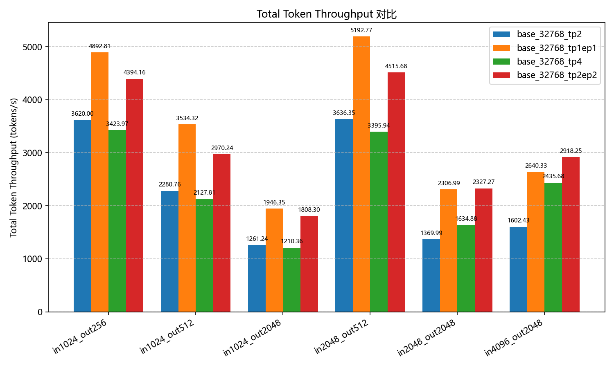

#### 1. vllm-ascend-v0.13.0 qwen3-30B-A3B优化镜像使用

##### 设备配套
| 配置项 | 值 |
| :--- | :--- |
| **推理卡** | 910B4 |
| **CANN 版本** | 8.5.0 |
| **架构** | x86 |
| **OS** | Linux |

##### 测试配置
| 参数 | 值 |
| :--- | :--- |
| 数据集 | GSM8k |
| num_prompts | 256 |
| batch_size | 128 |
| req_rate | 8 |
###### Throughput


##### 使用方法
1. 拉取镜像
```
docker pull yukiiiiii/vllm-ascend-attn-moe:v0.13.0
```
2. 启动容器
```
export IMAGE=docker.io/yukiiiiii/vllm-ascend-attn-moe:v0.13.0
docker run --rm \
    --name vllm-ascend-env \
    --shm-size=1g \
    --device $DEVICE \
    --device /dev/davinci_manager \
    --device /dev/devmm_svm \
    --device /dev/hisi_hdc \
    -v /usr/local/dcmi:/usr/local/dcmi \
    -v /usr/local/bin/npu-smi:/usr/local/bin/npu-smi \
    -v /usr/local/Ascend/driver/lib64/:/usr/local/Ascend/driver/lib64/ \
    -v /usr/local/Ascend/driver/version.info:/usr/local/Ascend/driver/version.info \
    -v /etc/ascend_install.info:/etc/ascend_install.info \
    -v /root/.cache:/root/.cache \
    -it $IMAGE bash
```

3. 使用vllm-ascend原仓算子库
```
source /vllm_workspace/vllm-ascend/vllm_ascend/_cann_custom_ops/vender/bin/set_env.sh
```

4. 使用参考脚本拉起模型
```
#!/bin/sh
export PYTHONPATH="/vllm_workspace/vllm-split-attn-moe/vllm:$PYTHONPATH"
export PYTHONPATH="/vllm_workspace/vllm-split-attn-moe/vllm-ascend:$PYTHONPATH"

MODEL=/model/Qwen3-30B-A3B
MODEL_NAME=qwen3_30b

# To reduce memory fragmentation and avoid out of memory
export PYTORCH_NPU_ALLOC_CONF=expandable_segments:True

export HCCL_BUFFSIZE=1024
export HCCL_OP_EXPANSION_MODE="AIV"
export OMP_PROC_BIND=false
export OMP_NUM_THREADS=10
export VLLM_ASCEND_ENABLE_FLASHCOMM1=1
export TASK_QUEUE_ENABLE=1

vllm serve $MODEL \
--host 0.0.0.0 \
--port 9000 \
--split-ep-size 2 \
--split-tp-size 2 \
--tensor-parallel-size 4 \
--enable-expert-parallel \
--seed 1024 \
--served-model-name $MODEL_NAME \
--max-num-seqs 128 \
--max-model-len 16384 \
--max-num-batched-tokens 4096 \
--trust-remote-code \
--gpu-memory-utilization 0.9 \
--no-enable-prefix-caching \
--enforce-eager \
--async-scheduling
```

5. 复现
基线脚本
```
#!/bin/sh
export PYTHONPATH="/vllm_workspace/vllm-split-attn-moe/vllm:$PYTHONPATH"
export PYTHONPATH="/vllm_workspace/vllm-split-attn-moe/vllm-ascend:$PYTHONPATH"

MODEL=/model/Qwen3-30B-A3B
MODEL_NAME=qwen3_30b

# To reduce memory fragmentation and avoid out of memory
export PYTORCH_NPU_ALLOC_CONF=expandable_segments:True

export HCCL_BUFFSIZE=1024
export HCCL_OP_EXPANSION_MODE="AIV"
export OMP_PROC_BIND=false
export OMP_NUM_THREADS=10
export VLLM_ASCEND_ENABLE_FLASHCOMM1=1
export TASK_QUEUE_ENABLE=1

vllm serve $MODEL \
--host 0.0.0.0 \
--port 9000 \
--tensor-parallel-size 4 \
--enable-expert-parallel \
--seed 1024 \
--served-model-name $MODEL_NAME \
--max-num-seqs 128 \
--max-model-len 16384 \
--max-num-batched-tokens 4096 \
--trust-remote-code \
--gpu-memory-utilization 0.9 \
--no-enable-prefix-caching \
--enforce-eager \
--async-scheduling
```

